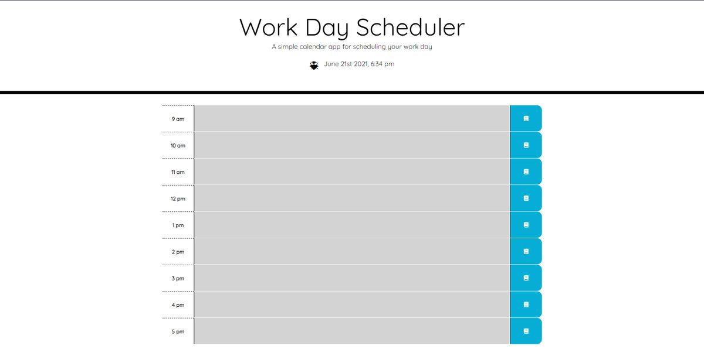

# Homework 5 - Work Day Scheduler
## Description
This is a simple day planner that saves hourly entries directly to local storage with a click of their corresponding buttons. Upon reloading or closing and reopening, all data is recalled. The current date and time is displayed at the top of the page and the entry fields on the planner are dynamically color-coded based on whether they are the present hour, the past, or the future.

## Screenshot

Check out the [deployed web page](https://neilburt.github.io/day-planner/).